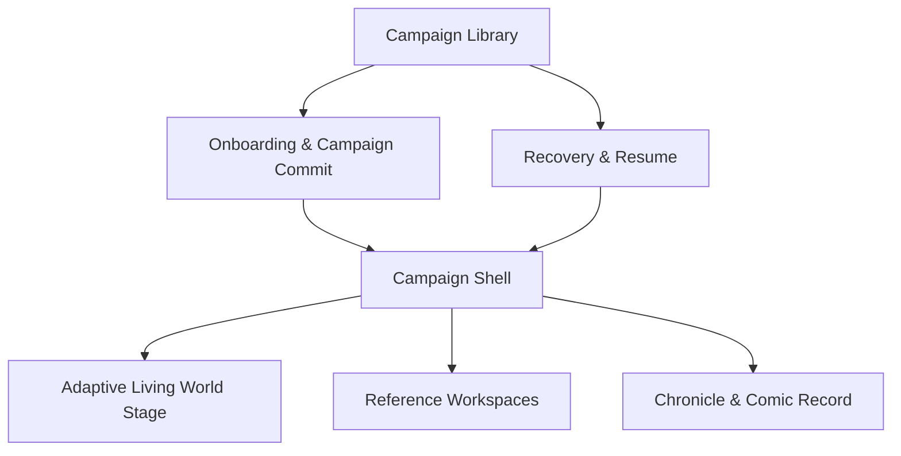
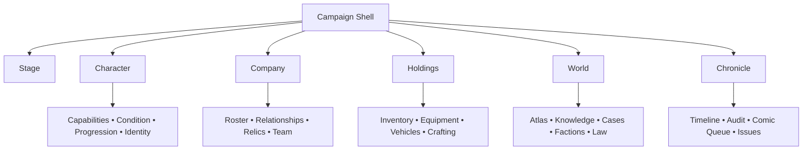
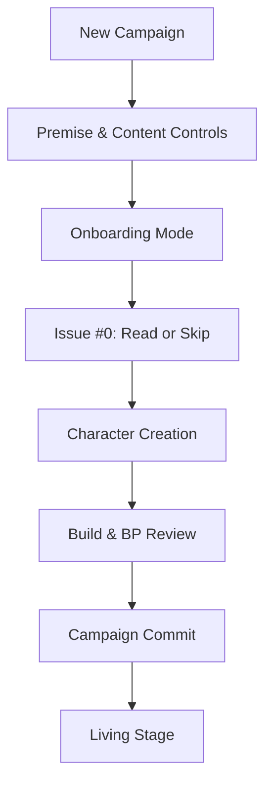

# Mythic Superhero RPG Platform
## Product Information Architecture v0.1A

**Status:** Proposal for product-owner review  
**Date:** 2026-08-22  
**Governing source:** *Mythic Superhero RPG Platform — World Constitution and Approved Design Register v1.27*  
**Approved dependencies:** *UX/UI Foundation v0.1A* and *Constitution-to-Interface Traceability Matrix v0.1*  
**Scope:** Global shell, navigation hierarchy, surface relationships, responsive behavior, entry/recovery architecture, knowledge-safe navigation, and navigation-state rules  
**Implementation authority:** None. This proposal does not authorize wireframes, visual design, prototypes, or front-end code.

---

## 1. Phase 1 Recommendation

Use a **world-centered hybrid information architecture** built around six stable campaign destinations:

1. **Stage** — what is happening now;
2. **Character** — who the protagonist is and can become;
3. **Company** — who travels, acts, disagrees, bonds, or shares power with the protagonist;
4. **Holdings** — what the character or party possesses, controls, builds, owes, or has lost;
5. **World** — where the character is, what they know, and which external forces are moving; and
6. **Chronicle** — what has happened, why the engine says it happened, and how the campaign is becoming a comic.

The **Adaptive Living World Stage remains the default and gravitational center**. Other destinations deepen understanding or support planning; they do not turn the product into disconnected mini-applications.

This structure favors intuitive player questions over engine taxonomies:

| Player question | Destination |
|---|---|
| What is happening, and what can I attempt? | Stage |
| Who am I, what can I do, and what is affecting me? | Character |
| Who is with me, what do they want, and what can we do together? | Company |
| What do we have, where is it, and what can we make or repair? | Holdings |
| Where are we, what do we know, and what is changing beyond us? | World |
| What happened, how was it resolved, and what has become part of the record? | Chronicle |

---

## 2. Product Architecture

The product has three architectural layers.

### 2.1 Campaign Library

The out-of-campaign layer contains:

- Resume last campaign;
- campaign selection;
- new campaign;
- import, duplicate, archive, and campaign details;
- save recovery and version-conflict recovery;
- Practice Sandbox entry;
- global profile, accessibility, content controls, input, audio, language, and support; and
- issue library access across campaigns, subject to campaign and edition permissions.

It should feel like entering a collection of persistent worlds, not opening a list of chat threads.

### 2.2 Campaign Shell

The in-campaign layer preserves the active campaign, viewpoint, Ledger Time, state version, navigation history, and player draft while the player moves among Stage and reference workspaces.

Its stable regions are:

| Region | IA responsibility |
|---|---|
| World Strip | Campaign/viewpoint identity, Ledger Time, location or uncertainty, danger, save/sync, accessible alerts, and comic-capture state |
| Campaign Rail | Six primary destinations; labels remain visible at desktop reference density |
| Active Surface | Stage or selected reference workspace |
| Context Lens | Object-level inspection without abandoning the active surface |
| Intent Dock | Always-reachable free intent, interpretation, correction, forecast, and commit sequence |
| Chronicle Ribbon | Recent canonical events and exact dialogue, collapsed until requested |

### 2.3 Reference Workspaces

Character, Company, Holdings, World, and Chronicle are deeper workspaces within the same campaign shell. They can support comparison, planning, audit, and long-form review without advancing time or discarding the current scene.

---

## 3. Global Navigation Model

### 3.1 Desktop campaign rail

The recommended desktop rail order is:

| Order | Destination | Default landing view | Persistent indicator examples |
|---:|---|---|---|
| 1 | Stage | Current Living Stage | Immediate danger, unresolved interrupt, pending clarification |
| 2 | Character | Character summary | New condition, recovery threshold, unspent approved progression |
| 3 | Company | Active roster | Pending autonomous choice, departure risk, team change |
| 4 | Holdings | Accessible holdings | Overload, broken gear, custody change, project completion |
| 5 | World | Current known locality | Route change, new evidence, accessible Front consequence, warrant |
| 6 | Chronicle | Recent campaign record | Catch-up digest, audit exception, comic queue or issue ready |

Home/campaign switching, notifications, save/sync, accessibility, settings, help, and account controls remain utilities in the World Strip rather than competing with campaign destinations.

### 3.2 Global route tree

The route tree expresses information ownership, not rigid page boundaries. A Relic may appear in Company, Holdings, World, and Chronicle, but it has one canonical object identity and each appearance links to the same knowledge-safe record.

---

## 4. Destination Hierarchy

### 4.1 Stage

The Stage owns the current play loop:

- current sensory and scene presentation;
- exact dialogue available to the active viewpoint;
- immediate spatial or positional context;
- changing world reactions;
- free-form intent;
- interpretation and material clarification;
- forecast of known costs, risks, duration, and collateral;
- commit, validation, dice, and resolution;
- concise, guided, or audit-depth outcome access;
- interrupts, reactions, simultaneous choices, and pending autonomous decisions; and
- transition among social, investigation, travel, exploration, combat, crafting, law, defeat, and comic-review emphasis.

The Stage does not own full inventory administration, the complete Character record, the whole Knowledge Map, or long-form audit. It exposes only the subset needed now and links to deeper workspaces.

### 4.2 Character

| Subarea | Contents |
|---|---|
| Overview | Identity, current resources, immediate conditions, recovery, active Drives/Complications, equipped capabilities |
| Capabilities | Attributes, skills, Talents, powers, techniques, Stunts, prerequisites, access and mastery |
| Condition | Wounds, impairments, transformations, survival pressure, recovery options and care provenance |
| Progression | Level, XP, BP ledger, training, checkpoints, legal purchases, comparison and full audit |
| Identity | Drives, Complications, morality-relevant state, Names, Epithets, Mantles, Claims, Legacy and successor links |

### 4.3 Company

| Subarea | Contents |
|---|---|
| Roster | Present, remote, missing, captured, unavailable, departed, dead, or otherwise relevant actors |
| Relationships | Observable history, statements, boundaries, grievances, consent, commitments and valid Insight |
| Relics | Sapient and nonsapient Relics, Attunement, Recognition, Bond presentation, Claims, access, Charge, corruption, breakage and reformation |
| Team | Membership, roles, doctrines, Cohesion/Integration presentation, team abilities and coordination |
| Autonomy | Delegations, standing instructions, pending decisions, refusals, counterproposals and communicated reasons |

Company must never imply that companions or sapient Relics are owned ability slots.

### 4.4 Holdings

| Subarea | Contents |
|---|---|
| Inventory | Accessible, carried, stored, cached, lost, seized, stolen, loaned, destroyed, or last-known items |
| Equipment | Load, access state, slots where rules require them, ammunition, condition, comparison, modification and repair |
| Custody & Economy | Ownership, custody, permissions, money, debts, purchases, sales, theft, evidence custody and transaction records |
| Vehicles | Access, storage, passengers, condition, fuel/supplies, pursuit state, upgrades and route suitability |
| Crafting & Projects | Recipes/designs, facilities, tools, materials, progress, risk, research, salvage and resulting object provenance |

### 4.5 World

| Subarea | Contents |
|---|---|
| Atlas & Travel | Known geography, location uncertainty, routes, time, weather, supplies, roles, camps, pursuit and realm crossings |
| Knowledge Map | Perceived, recorded, reported, inferred, disputed, forecast, last-known and out-of-character claims |
| Exploration & Sites | Discovered topology, zones, Connections, searches, hazards, secrets already found, persistent site change and fog |
| Cases & Evidence | Questions, Claims, Leads, evidence, witnesses, contradictions, collection, custody, analysis and objectives |
| Factions & Fronts | Known actors, projects, relationships, accessible indicators, communicated developments and consequences |
| Law & Reputation | Jurisdictions, authority, evidence chains, warrants, Heat, Exposure, Notoriety, reputation and contradictory law |

World deliberately combines map, investigation, faction, and law systems because they describe the character's relationship with external reality. Local subnavigation and object links prevent this broad destination from becoming one overloaded screen.

### 4.6 Chronicle

| Subarea | Contents |
|---|---|
| Timeline | Timestamped events, exact dialogue, state changes, receipts and accessible catch-up digests |
| Audit & Provenance | Rolls, formulas, validators, seeds, costs, state versions, sources, corrections and conflicts without secret leakage |
| Comic Queue | Capture status, Inflection points, Source Lock, durable stages, exceptions and honest background progress |
| Issue Library | Finished issues and authorized editions; no partial work presented as complete |
| Reader | Read completed issues without teaching the active character unavailable facts |
| Editor | Optional WIP/edition review, corrections and provenance, only when enabled and permission-safe |

Comic capture remains visible in the World Strip, while long-form queue and issue work lives in Chronicle. This keeps the game's unique legacy feature prominent without making comic production a gameplay dependency.

---

## 5. Object-First Navigation: Lens, Focus, Pin, Act

Section navigation alone is insufficient for a living world. Every surfaced person, place, item, Relic, clue, faction, condition, project, rule term, and event can become a contextual object link.

The player has four consistent object operations:

| Operation | Result |
|---|---|
| **Lens** | Opens a knowledge-safe summary beside or over the current surface; no scene or draft loss |
| **Focus** | Opens the object's owning workspace for deeper inspection |
| **Pin** | Keeps one relevant object beside the active surface on capable desktop widths |
| **Act** | References the object in the Intent Dock or a legal structured command; never commits automatically |

This hybrid model makes the product learnable through stable sections while allowing expert players to move through relationships among world objects.

### 5.1 Ownership examples

| Object | Owning workspace | Common contextual appearances |
|---|---|---|
| Active companion | Company | Stage, World, Chronicle |
| Sapient Relic | Company | Stage, Holdings, Character, Chronicle |
| Nonsapient equipment | Holdings | Stage, Character, Chronicle |
| Wound | Character | Stage, Company care context, Chronicle |
| Location or route | World | Stage, Holdings/vehicle planning, Chronicle |
| Evidence item | World / Cases | Stage, Holdings/custody, Chronicle |
| Faction project | World / Factions | Stage, Cases, Chronicle |
| Comic issue | Chronicle | World Strip indicator, Campaign Library |

---

## 6. Stage Adaptation Without Mode Fragmentation

The Stage changes emphasis but retains the same shell and intent model.

| World condition | Stage emphasis | Persistent cross-system state |
|---|---|---|
| Social | People, exact dialogue, stated intent, relationships, communication access | Location, time, danger, conditions, witnesses, Intent Dock |
| Investigation | Evidence, Questions, Claims, contradictions, sources | Scene, actors, custody, time, law, unrestricted intent |
| Travel | Route, duration, weather, supplies, roles, uncertainty | Party, vehicle, Front consequences, survival, Intent Dock |
| Exploration | Sensory scope, discovered topology, searches, hazards | Time, fatigue, inventory, location uncertainty, evidence |
| Immediate danger | Initiative, position, actions, reactions, hazards | Scene geography, escape, speech, surrender, inventory, evidence |
| Crafting | Project, facility, materials, tools, risks, progress | Time, law, custody, party assistance, interrupting danger |
| Law | Jurisdiction, authority, evidence, warrants, Heat | Scene, speech, escape, faction ties, property and custody |
| Defeat or death | Wounds, Dying, surrender, capture, afterlife or succession | Canonical scene, relationships, body/soul custody, Chronicle |

Combat is therefore an intensified state of Stage—not a separate game board that erases the rest of the world.

---

## 7. Entry, Onboarding, and Recovery Architecture

### 7.1 New campaign flow

Issue #0 is optional, skippable, and separately labeled as player-facing reading. It does not populate Character Knowledge unless the character later receives the information through valid means.

Character creation supports every approved mode through a shared review and Campaign Commit boundary. A player may inspect every BP and rule path without forcing that audit density on a new player.

### 7.2 Resume and recovery

Resume follows this hierarchy:

1. identify the campaign and last committed state;
2. distinguish local draft, committed campaign state, and background comic-production state;
3. validate version and connection;
4. recover an uncommitted draft when safe;
5. explain any conflict before overwriting or retrying; and
6. return the player to the exact prior Stage context, with an accessible catch-up digest only for campaign time that actually advanced.

Unknown commit status cannot be treated as failure and blindly retried. Recovery first checks idempotency and canonical event receipts.

---

## 8. Navigation-State Contract

Navigation itself never advances Ledger Time or mutates canon.

The shell preserves:

- current campaign and active viewpoint;
- current Stage context;
- uncommitted Intent Dock draft;
- interpreted action and its source state version;
- Lens and pinned objects;
- chosen explanation depth;
- filters, scroll, zoom, and comparison state where safe;
- accessibility and input preferences; and
- the return point for browser Back and workspace close.

### 8.1 Material state change while browsing

When committed or externally processed state changes:

- nonmaterial accessible updates may merge with a visible timestamp;
- material changes invalidate affected forecasts and interpretations;
- a stale action cannot commit silently;
- the player is shown what accessible state changed;
- engine-only changes do not leak through the conflict explanation; and
- the player may review, revise, or cancel from the preserved underlying goal.

### 8.2 Campaign switching

Changing campaigns is a utility action, not ordinary in-world navigation. The shell first preserves or explicitly discards uncommitted local work, confirms save/sync health, and then establishes the selected campaign's independent time, viewpoint, state, and Chronicle.

---

## 9. Knowledge-Safe Navigation

Navigation and search results obey the active viewpoint's accessible knowledge.

### 9.1 Search scopes

| Scope | May contain | Must exclude |
|---|---|---|
| Current character | Permitted perceived, recorded, reported, inferred, forecast, disputed and last-known information | Engine truth and inaccessible actor knowledge |
| Accessible records | Records the character can presently retrieve, with source and time | Unreceived documents and inaccessible archives |
| Player library | Finished issues, Issue #0 and approved out-of-character material | Use as automatic character-action support |
| Audit | Accessible inputs and provenance for committed events | Hidden identities, motives, participants and inaccessible validator inputs |

Search must not reveal hidden entities through autocomplete, empty-result counts, URL structure, badges, loading placeholders, or inaccessible relationship edges.

### 9.2 Visible claim treatment

Object labels and summaries carry classification when it matters: Perceived, Recorded, Reported, Inferred, Forecast, Disputed, Last Known, or Out-of-Character. A Lens inherits the active viewpoint; it cannot become an omniscient encyclopedia.

---

## 10. Notification and Attention Hierarchy

The architecture uses four attention levels:

| Level | Use | Presentation rule |
|---|---|---|
| Blocking | Material clarification, destructive confirmation, stale commit, unresolved version conflict | Interrupt only the affected action; preserve goal and context |
| Urgent | Immediate danger, reaction window, Dying, expiring accessible decision | Stage and World Strip; semantic text plus noncolor cue |
| Actionable | Recovery option, companion response, project completion, warrant, comic exception | Badge plus destination-specific inbox/digest |
| Informational | Accessible off-screen consequence, new record, comic stage progress | Chronicle digest; avoid interrupting play |

Notifications state only what the active viewpoint may know. “A faction clock advanced” is not a valid notification unless accessible evidence or consequence supports that conclusion.

---

## 11. Responsive Behavior

Desktop browser remains the reference target. The following are **behavioral validation bands**, not final design-token breakpoints.

| Band | Composition | Capability rule |
|---|---|---|
| Reference desktop, approximately 1440×900 and above | Labeled campaign rail, Stage, persistent Intent Dock, optional Lens/pinned object, World Strip, collapsed Chronicle Ribbon | Highest simultaneous density; keyboard-first expert operation |
| Compact desktop, approximately 1280×720 to 1439 wide | Compact rail, Stage and Intent Dock remain; Lens overlays or temporarily replaces a secondary region | No critical state hidden; draft and scene preserved |
| Tablet | One primary surface plus Context Lens sheet; compact destination navigation; Intent Dock persistently reachable | Same action capability through sequential layers |
| Mobile | One focused layer at a time; Stage-first return; condensed World Strip; object Lens and Intent Dock become full-width layers | Capability parity, not density parity; exact composition deferred until desktop flows are approved |

No band may require hover, precise drag, motion, or color to perceive state or complete the core loop. Large text and screen-reader modes may switch to sequential composition even on desktop.

---

## 12. Browser, Deep-Link, and Accessibility Semantics

- Browser Back returns to the prior surface, Lens, filter, or Stage context without rewinding canon.
- A safe deep link may identify campaign, surface, object, and event receipt, but never perform a state mutation.
- Inaccessible or later-invalid deep links resolve to a knowledge-safe explanation, not a hidden object title.
- Canonical commands require validated in-product commit, even when initiated from a deep-linked object.
- Every primary destination is a named landmark.
- Stage, Intent Dock, Context Lens, World Strip, and Chronicle Ribbon have stable semantic regions.
- Badges and danger levels have text alternatives and do not rely on position or color alone.
- Focus order follows play: perceive, inspect, declare, review, commit, resolve, continue.
- Keyboard shortcuts accelerate navigation but never become the sole access path.

---

## 13. Progressive Disclosure Across the IA

The navigation is stable from the beginning, but destinations reveal relevant depth without pretending unencountered concepts are absent from the rules.

| Player stage | IA treatment |
|---|---|
| First 90 seconds | Stage is primary; Character and Company summaries are available; nonrelevant workspaces remain quiet rather than tutorial-locked |
| First scene | Chronicle introduces persistence; Holdings and World surface only current, understandable state |
| First encounter with a system | The owning workspace highlights the relevant subarea and provides a short “why this matters” explanation |
| Early campaign | World and Company relationships become richer as knowledge and actors accumulate |
| Expert play | Direct object navigation, pinning, comparison, full audit, filters and keyboard navigation become discoverable accelerators |

An empty destination explains what belongs there and how state may legitimately appear. It does not tease hidden content or imply a required storyline.

---

## 14. Alternatives Considered

| Alternative | Reason not recommended |
|---|---|
| Chat plus tool drawer | Makes free-form input look like conversation with a bot and buries mechanical/world state in prose |
| Equal-weight dashboard | Overloads new players, weakens scene hierarchy, and makes every system feel simultaneously urgent |
| Separate application per system | Fragments the world, loses cross-system consequences, and creates mode-switching cost |
| Pure object graph with no stable sections | Powerful for experts but difficult to learn, name, navigate, and make accessible |
| Mobile-first single column as reference | Forces desktop play to surrender useful simultaneous context and audit density |
| Comic as the main runtime shell | Confuses captured/adapted record with live canonical play and implies real-time production |

---

## 15. Product-Owner Decisions Requested

### IA-001 — Global navigation vocabulary

**Recommended: Hybrid clarity**

| Option | Labels | Tradeoff |
|---|---|---|
| **A — Hybrid clarity (recommended)** | Stage, Character, Company, Holdings, World, Chronicle | Intuitive but distinctive; “Company” supports companions, teams and Relics without implying ownership |
| B — Familiar RPG | Play, Character, Party, Inventory, World, Journal | Fastest recognition, but undersells autonomy, custody, world systems and the campaign record |
| C — Fully diegetic | Stage, Self, Company, Holdings, Atlas, Chronicle | Strong flavor, but “Self” and “Atlas” are less immediately clear |

### IA-002 — Comic prominence

**Recommended: Chronicle-owned with persistent status**

| Option | Behavior | Tradeoff |
|---|---|---|
| **A — Chronicle-owned (recommended)** | Capture/status in World Strip; queue, issues, reader and editor in Chronicle | Keeps comic unique and visible without competing with live play |
| B — Dedicated seventh destination | Comic receives its own campaign-rail destination | Strong prominence, but increases global navigation and can overstate runtime dependency |
| C — Campaign Library only | Comic is outside the runtime except a small status indicator | Clean runtime, but weakens the lived-play-to-legacy connection |

### IA-003 — Reference workspace behavior

**Recommended: Lens + Focus + optional Pin**

| Option | Behavior | Tradeoff |
|---|---|---|
| **A — Hybrid (recommended)** | Quick Lens, deep Focus, optional desktop Pin, consistent Act handoff | Best balance of continuity, expert depth and responsive adaptation |
| B — Permanent split | Stage always beside the active reference workspace | Strong continuity but cramped and dashboard-like at ordinary widths |
| C — Full replacement | Every destination replaces Stage until Back | Simplest layout, but weakens world continuity and risks draft/context loss |

---

## 16. Phase 1 Acceptance Checks

This IA is acceptable only if later designs can demonstrate that:

1. a new player can identify Stage, Character, companions, possessions, world knowledge and campaign history without learning engine vocabulary;
2. Stage remains recognizably primary throughout ordinary play;
3. free intent is always reachable and suggestions never appear to define permission;
4. opening any reference workspace preserves the live scene and uncommitted draft;
5. a companion and a sapient Relic are not presented as inventory;
6. a lost character can navigate the World without seeing exact engine location;
7. evidence, faction and law navigation cannot leak hidden canon;
8. combat, defeat, death, afterlife and succession remain states of the same campaign shell;
9. comic progress remains visible but never blocks play or masquerades partial output as finished;
10. browser Back, reconnect and stale-state recovery preserve causal clarity;
11. screen-reader and reduced-input users can traverse the complete architecture; and
12. tablet and mobile can preserve capability through sequential layers after desktop reference flows are approved.

---

## 17. Approval Boundary

Approval of Product Information Architecture v0.1A will lock:

- the three-layer product architecture;
- the six primary campaign destinations;
- the hierarchy and ownership of required surfaces;
- the Stage-centered shell relationship;
- object-first Lens, Focus, Pin and Act navigation;
- Campaign Library, onboarding and recovery placement;
- knowledge-safe search and deep-link boundaries;
- navigation-state preservation rules;
- notification hierarchy; and
- responsive capability strategy.

Approval does **not** lock typography, color, visual direction, exact component geometry, final breakpoints, individual screen layouts, animation, wireframes, prototypes, or production implementation.

After approval, the next gate is **Phase 2 — Core Gameplay Interaction Model**, where the perceive → inspect → declare → interpret → clarify → forecast → commit → resolve → continue loop will be specified in full, including combat transition, result depth, autonomy, stale-state behavior and comic indicators.
