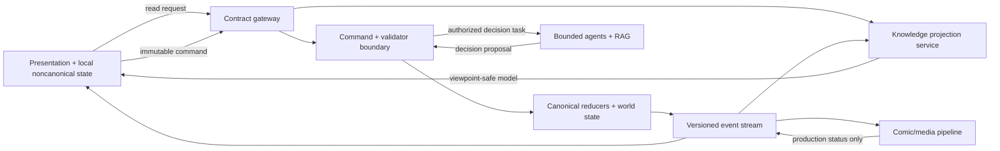

# Mythic Superhero RPG Platform
## Engine/UI Contract Foundation v0.1A

**Status:** Approved and locked — 2026-08-23  
**Date:** 2026-08-23  
**Phase:** 6 — Engine/UI implementation contracts  
**Governing source:** *Mythic Superhero RPG Platform — World Constitution and Approved Design Register v1.27*  
**Approved UX authority:** UX/UI Phases 0–5B, including high-fidelity prototype version 4  
**Scope:** Contract architecture, authority boundaries, shared envelopes, lifecycle semantics, gap resolutions, acceptance strategy and Phase 6 delivery sequence  
**Implementation boundary:** This proposal defines contracts. It does not connect a live engine or authorize production front-end construction.

---

## 1. Recommendation

Adopt a **contract-first, event-aware, projection-driven architecture** in which the UI receives viewpoint-safe read models and emits immutable commands through validated interfaces. Canonical reducers, validators and world simulation remain the only authorities that may change campaign state.

The contract system should use:

- JSON Schema Draft 2020-12 as the shared payload-schema dialect;
- OpenAPI 3.1.2 for synchronous HTTP reads, proposals, forecasts, commands and receipts;
- AsyncAPI 3.1.0 for state, decision-window, autonomous-actor, recovery and comic-production events;
- generated TypeScript consumer types plus runtime validation from the schemas;
- deterministic fixtures and consumer/provider contract tests; and
- an explicit implementation matrix that traces every approved surface and component to its read models, commands, events, permissions, accessibility semantics and tests.

OpenAPI 3.2.0 is the latest published specification as of this proposal, but 3.1.2 is recommended for the first implementation contract because it is mature, aligns with the chosen JSON Schema family, and reduces avoidable tooling risk. The specifications can advance only through a versioned contract decision, never silently.

Official standard references:

- https://spec.openapis.org/oas/v3.1.2.html
- https://json-schema.org/draft/2020-12
- https://www.asyncapi.com/docs/reference/specification/v3.1.0

---

## 2. Authority Architecture

### 2.1 Five protected planes

| Plane | Owns | Must not own |
|---|---|---|
| Canonical state plane | Campaign state, Ledger Time, reducers, events, rules, dice, custody, damage, geography and consequences | UI layout, generated prose authority or provider job progress |
| Knowledge projection plane | Viewpoint-safe read models, Knowledge Maps, evidence classifications, accessible deltas and redaction by construction | Hidden truth in nullable fields or UI-only filtering |
| Command plane | Immutable commands, idempotency, validation, permissions, conflict detection and receipts | Narrative improvisation or silent intent substitution |
| Agent/RAG plane | Intent interpretation, bounded autonomous decisions, accessible explanation, narration and media assistance | Direct canonical mutation, permission bypass, private chain-of-thought disclosure or uncited rule invention |
| Presentation/media plane | Rendering, input, local drafts, preferences, accessibility, comic production and generated assets | Canon, Ledger Time, final legal state, inventory truth or world simulation |

### 2.2 Noncanonical UI state

The UI may own only reversible presentation state such as:

- unsent drafts and local draft history;
- active destination, open Lens, pin and focus;
- explanation depth, density, contrast, large text and motion preferences;
- filters, sorting and reader position;
- selected alternate-input method;
- dismissed nonmandatory notices; and
- temporary rendering/cache metadata.

The UI may not own authoritative time, position, resources, Wounds, custody, permissions, relationships, Bond, Front state, law, event results, dice or comic publication state.

---

## 3. Contract Artifact Stack

| Artifact | Purpose | Source of truth |
|---|---|---|
| `schemas/common/*.schema.json` | IDs, time, versions, knowledge, provenance, freshness, errors and receipts | JSON Schema |
| `schemas/read-models/*.schema.json` | Viewpoint-safe surface payloads | JSON Schema |
| `schemas/commands/*.schema.json` | Immutable player/system/agent command payloads | JSON Schema |
| `schemas/events/*.schema.json` | Canonical and projection-event payloads | JSON Schema |
| `openapi/mythic-ui.yaml` | Synchronous reads, proposals, forecasts, commit and recovery operations | OpenAPI |
| `asyncapi/mythic-events.yaml` | State/event subscriptions and production updates | AsyncAPI |
| `generated/typescript/` | Generated consumer types and validators | Generated only; never hand-edited |
| `fixtures/` | Deterministic success, failure, refusal, interruption, unavailable, impossible, destructive and conflict cases | Approved contract examples |
| `tests/contracts/` | Provider, consumer, knowledge-leakage and idempotency tests | Executable acceptance evidence |
| Contract matrix | Surface/component-to-contract trace | Phase 6 controlled workbook |

Handwritten frontend domain interfaces that duplicate schema-owned models are prohibited. A build must fail when generated consumers drift from approved schemas.

---

## 4. Universal Contract Envelope

Every read model, command, receipt and event uses a shared envelope appropriate to its direction.

### 4.1 Read-model envelope

| Field | Requirement |
|---|---|
| `contract_version` | Semantic version of the payload contract |
| `payload_type` | Stable discriminator, such as `stage_frame` |
| `campaign_id` | Opaque campaign identifier |
| `viewpoint_id` | Active character/player-access viewpoint used for projection |
| `state_version` | Opaque monotonic canonical state version |
| `knowledge_snapshot_id` | Exact knowledge projection basis |
| `ledger_time` | Structured campaign time plus approved display form |
| `generated_at` | Real-world response timestamp; never substituted for Ledger Time |
| `freshness` | `current`, `superseded_nonmaterial`, `stale_material`, `last_known`, `disputed` or `unknown` |
| `permissions` | Actions that may be requested, with reasons where inaccessible |
| `provenance` | Accessible source/event references and correction lineage |
| `payload` | Viewpoint-safe model containing no hidden-field placeholders |

### 4.2 Command envelope

| Field | Requirement |
|---|---|
| `command_id` | Unique client-generated identifier |
| `command_type` | Stable command discriminator |
| `idempotency_key` | Required for every command that could create canonical mutation |
| `campaign_id` | Target campaign |
| `actor_id` | Actor whose legal action is requested |
| `viewpoint_id` | Viewpoint under which the player authorized it |
| `source_state_version` | Exact state reviewed before commitment |
| `knowledge_snapshot_id` | Accessible knowledge used for interpretation/forecast |
| `proposal_id` | Required when committing an interpreted proposal |
| `confirmation_class` | `routine`, `material` or `consequential` |
| `input_provenance` | Typed, dictated, structured, prior-pattern or system-decision source |
| `payload` | Command-specific immutable content |

### 4.3 Receipt envelope

Every command receives a durable lookup key and one of:

- `accepted_pending` — acknowledged; outcome not yet known;
- `committed` — canonical event IDs and state version returned;
- `rejected` — no rejected-action cost; revision information returned;
- `replan_required` — accessible state or actor decision invalidated the method;
- `conflict` — version cannot be reconciled safely;
- `queued` — legal asynchronous dependency exists;
- `retryable_failure` — no duplicate-safe canonical mutation occurred;
- `unknown_commit` — lookup is required before retry; or
- `canceled` — only when the engine confirms cancellation was still legal.

The UI never infers a failed commit from a lost response.

---

## 5. Knowledge and Provenance Contract

### 5.1 Knowledge classes

Every fact exposed through a player-facing model is classified as one of:

| Class | Meaning |
|---|---|
| `perceived` | Directly sensed by the active viewpoint |
| `recorded` | Available in an accessible durable record |
| `reported` | Communicated claim attributed to a source |
| `inferred` | Supported conclusion available to the active character |
| `forecast` | Noncanonical projection from accessible assumptions |
| `disputed` | Accessible claims materially conflict |
| `last_known` | Previously supported state whose present truth is not established |
| `out_of_character` | Player-accessible material excluded from character assistance |

Hidden canonical truth is not a client-visible class. It is omitted by construction before serialization.

### 5.2 Fact provenance

A material surfaced fact may include:

- `fact_id`;
- knowledge class;
- accessible source reference;
- `as_of_ledger_time`;
- received/observed channel;
- confidence band when rules permit it;
- contradiction references;
- correction/supersession lineage; and
- visibility scope.

The client must not receive private motives, secret Drives, hidden coordinates, complete Front clocks, unrevealed immunities, unpublished rules truth or developer diagnostics in an otherwise hidden field.

---

## 6. Core Read-Model Families

| ID | Read model | Primary consumers |
|---|---|---|
| RM-001 | Campaign Library Summary | Home, recovery and campaign entry |
| RM-002 | World Strip Status | Global shell |
| RM-003 | Stage Frame | Living Stage, danger and defeat variants |
| RM-004 | Entity Context Lens | Stage and connected records |
| RM-005 | Intent Capability | Intent Dock and alternate-input tray |
| RM-006 | Decision Window / Interrupt Queue | Stage and immediate danger |
| RM-007 | Character Record | Character, BP, Wounds and identity |
| RM-008 | Company and Relationship Record | Company, companions and agreements |
| RM-009 | Relic Relationship Record | Character, Relic and Stage Lens |
| RM-010 | Holdings and Project Record | Holdings, custody, access, craft and repair |
| RM-011 | World Knowledge Record | Maps, routes, travel, sites and last-known state |
| RM-012 | Evidence / Front / Legal Record | Investigation, factions, Fronts, law and reputation |
| RM-013 | Chronicle Feed and Audit Receipt | Chronicle Ribbon, event history and explanations |
| RM-014 | Comic Production and Reader Record | Comic queue, reader and edition history |
| RM-015 | Attention and Recovery Record | Reconnect, stale state, conflicts and support |

Each family will be decomposed into focused schemas. A surface may compose several models, but no read model may become a universal omniscient dashboard payload.

---

## 7. Core Command Families

| ID | Command or request | Canonical effect |
|---|---|---|
| CMD-001 | Interpret Intent | None; creates versioned noncanonical proposal |
| CMD-002 | Clarify / Revise Proposal | None; supersedes proposal version |
| CMD-003 | Forecast Proposal | None; creates accessible forecast with invalidation conditions |
| CMD-004 | Commit Action | May mutate canon after validation and resolution |
| CMD-005 | Respond to Decision Window | May mutate canon within legal timing |
| CMD-006 | Cancel Eligible Action | Mutates only if cancellation remains rules-valid |
| CMD-007 | Submit Autonomous-Actor Request | Creates request; never guarantees actor compliance |
| CMD-008 | Plan / Commit Journey or Time Compression | Draft is noncanonical; committed intervals mutate through ordered events |
| CMD-009 | Draft / Commit Advancement | Draft is noncanonical; commit spends only validated BP |
| CMD-010 | Draft / Commit Project Interval | Craft, repair, training and research use persistent checkpoints |
| CMD-011 | Record Content-Boundary Decision | Prospective campaign policy; never retroactive canon rewrite |
| CMD-012 | Submit Comic Review Decision | Media/edition workflow only; cannot mutate campaign canon |
| CMD-013 | Resolve Commit Status | Read-only idempotency lookup before any retry |
| CMD-014 | Update Presentation Preference | Noncanonical preference state only |

Commands must state who is acting, what authority is invoked and which version was reviewed. A typed request to a companion or sapient Relic is never translated into an obedience command.

---

## 8. Event Families

| ID | Event family | Purpose |
|---|---|---|
| EVF-001 | Canonical State Committed | New state version, Ledger Time and event lineage |
| EVF-002 | Accessible Projection Updated | Knowledge-safe delta for an active viewpoint |
| EVF-003 | Decision Window Changed | Opened, updated, closed, expired or resolved timing state |
| EVF-004 | Command Status Changed | Pending, committed, rejected, conflict or recovery state |
| EVF-005 | Autonomous Actor Status Changed | Observable deciding, counterproposal, refusal, action or unavailability |
| EVF-006 | Attention Digest Updated | Knowledge-safe grouping of off-screen consequences |
| EVF-007 | Recovery Required | Unknown commit, stale proposal, provider failure or save conflict |
| EVF-008 | Comic Job Status Changed | Durable media stage without invented percentage |
| EVF-009 | Comic Edition Published / Superseded | Immutable edition and correction lineage |
| EVF-010 | Accessibility Announcement | Semantic event change requiring polite or assertive announcement |

Event ordering cannot create rules priority. Causal order, state version, correlation and causation identifiers come from the engine boundary.

---

## 9. Rejection, Refusal, Unavailability and Conflict

### 9.1 Public outcome taxonomy

| Family | Example code | Meaning |
|---|---|---|
| Causal rejection | `rejected.causal_impossible` | The method cannot work from accessible state |
| Rules rejection | `rejected.rule_invalid` | The requested procedure is not legal under the rules |
| Actor refusal | `refused.actor_boundary` | Autonomous person, Relic or institution says no |
| Access unavailable | `unavailable.access` | Required route, item, authority, service or actor cannot currently be accessed |
| Timing unavailable | `unavailable.window_closed` | A legal timing window is absent or ended |
| Replan | `replan.state_changed` | Accessible change invalidated the committed method |
| Stale conflict | `conflict.state_version` | Reviewed state differs materially from current state |
| Unknown commit | `recovery.unknown_commit` | Submission status must be looked up before retry |
| Provider failure | `unavailable.provider` | Noncanonical generation or dependency failed |

### 9.2 Actor-safe rejection payload

The public payload contains only:

- stable public code;
- preserved player goal;
- interpreted method;
- concrete accessible obstacle;
- possible portion, if any;
- revisable fields;
- whether any cost/time/roll was spent;
- retry/revision eligibility;
- current accessible version; and
- provenance or help references.

Developer diagnostics, hidden validators and private actor motives use a separate protected diagnostic channel that is never serialized into player payloads.

---

## 10. Staleness, Caching and Optimistic Behavior

### 10.1 Freshness policy

| State | UI behavior |
|---|---|
| `current` | Normal use |
| `superseded_nonmaterial` | Merge accessible delta and timestamp; proposal may remain valid |
| `stale_material` | Suspend commit; compare, revise or reconfirm |
| `last_known` | Present age/source and avoid current-state language |
| `disputed` | Show claim conflict without truth declaration |
| `unknown` | State absence honestly; never synthesize a clean value |

### 10.2 Optimistic policy

Optimistic UI is permitted for presentation preferences, local drafts, pin/focus state, filters and noncanonical media-reader position.

Optimistic canonical mutation is prohibited for:

- Ledger Time;
- BP, resources, Charge, ammunition or materials;
- Wounds, damage, death or recovery;
- position, routes or site topology;
- custody, ownership, permission or legal authority;
- relationship, Bond, Claim, consent or actor decision;
- dice outcomes and world consequences; and
- comic publication or edition state.

### 10.3 Cache keys and invalidation

Canonical projections are keyed by campaign, viewpoint, knowledge snapshot, model type and state version. Campaigns may never share authoritative cache entries. Stale cached projections remain usable only when labeled with their freshness and when the requested action does not rely on outdated authority.

---

## 11. Agent and RAG Contracts

| Role | Permitted input | Permitted output | Hard prohibition |
|---|---|---|---|
| Intent interpreter | Player draft plus viewpoint-safe references | Structured proposal and material ambiguity list | Choosing materially different intent silently |
| Rules/lore explainer | Accessible question plus approved sources | Cited explanation at selected depth | Inventing rules or exposing hidden canon |
| Autonomous actor agent | Actor-safe private state, activation budget and legal options | Typed decision proposal with public observable/stated result | Direct reducer write or chain-of-thought disclosure |
| Scene narrator | Committed result packet plus viewpoint-safe projection | Presentation prose and accessibility text | Adding facts, actors, motives or outcomes |
| Comic pipeline agent | Source-locked canonical event range and knowledge ceiling | Script/art/lettering/QA candidates | Editing campaign canon or presenting WIP as published |

All agent outputs are untrusted proposals until the appropriate validator, reducer or media QA gate accepts them. Autonomous actor decisions pass through the same timing, permission and event rules as other canonical actions.

RAG responses require source identifiers, version, accessible citation spans and knowledge scope. Retrieval results that are not safe for the current viewpoint are excluded before generation, not merely hidden during rendering.

---

## 12. Accessibility Contract

Every material update may include an accessibility-semantic companion object:

| Field | Purpose |
|---|---|
| `semantic_role` | Region, status, alert, dialogue, log, timer or decision |
| `announcement_priority` | `none`, `polite` or `assertive` |
| `announcement_text` | Concise knowledge-safe state change |
| `dedupe_key` | Prevent repeated announcement of the same event/version |
| `focus_recommendation` | Suggested destination; never automatic focus theft without cause |
| `text_alternative` | Equivalent meaning for visual/audio/motion result |
| `structured_options` | Non-pointer access to relevant choices when rules enumerate them |
| `time_semantics` | Deadline and pause state in machine-readable form |

The contract supplies meaning; the frontend owns standards-compliant DOM behavior. Contract tests will verify that required semantic data is present, while browser and assistive-technology tests remain implementation gates.

---

## 13. Analytics Boundary

Analytics may measure:

- time to first meaningful player-authored or state-changing choice;
- abandonment by interaction state;
- clarification frequency and corrected interpretation fields;
- rejection family, retry and successful revision rate;
- explanation-depth usage;
- recovery/conflict frequency;
- input modality and accessibility-feature usage when consent and privacy permit;
- comic queue visibility and voluntary review; and
- performance/latency by contract operation.

Analytics must not:

- alter dice, encounters, world state, suggestions or consequences;
- classify morality as a product-success metric;
- record free-form intent, private dialogue or sensitive content by default;
- ingest hidden canonical truth into player analytics;
- train an optimization loop that narrows legal player intent; or
- become a second event ledger.

Analytics receives opaque IDs and approved categories, not canonical payload copies.

---

## 14. Phase 0 Gap Resolution Recommendations

| Gap | Recommended Phase 6 decision |
|---|---|
| GAP-001 | Adopt the public outcome taxonomy and actor-safe rejection payload in §9 |
| GAP-005 | Aggregate accessible notices by cause, Ledger Time, urgency, action requirement and source; never summarize unknown events |
| GAP-006 | Auto-merge only nonmaterial accessible deltas; material target, cost, risk, timing, permission, knowledge or consequence changes require review |
| GAP-007 | Use the explicit pending-state vocabulary; no invented percentages or completion times |
| GAP-008 | Comic jobs expose durable named stages, retryability and blockers; estimates only from provider-backed data |
| GAP-009 | WIP is opt-in per campaign/profile and always constrained by Source Lock and Reader knowledge ceiling |
| GAP-010 | Content conflicts reroute future generation or escalate; established canon is never silently rewritten |
| GAP-011 | Constrained-state payload names source, duration, prohibited/required choices, remaining choices and provenance without implying general control |
| GAP-012 | Manual/external dice records source, entered result, verification, confirmation, correction and replay policy; accessibility settings cannot change odds |
| GAP-014 | Every canonical command is idempotent; unknown status must resolve by lookup before retry |
| GAP-016 | Published comic editions are immutable; corrections create a superseding edition with source and changed-asset lineage |

---

## 15. Contract Acceptance Harness

The Phase 6 harness will include:

1. schema validation for every request, response and event fixture;
2. consumer/provider compatibility tests;
3. golden core-loop fixtures from Draft through Receipt;
4. negative knowledge-leakage fixtures for maps, evidence, Fronts, actors and RAG;
5. idempotent commit and unknown-status recovery tests;
6. stale proposal tests for nonmaterial merge and material reconfirmation;
7. refusal-versus-rejection-versus-unavailability discrimination tests;
8. autonomous actor decision and cancellation-window tests;
9. destructive persistence and continuation tests;
10. comic queue, WIP ceiling and immutable-edition tests;
11. accessibility-semantic completeness tests;
12. analytics payload privacy tests; and
13. all seventeen approved UX scenarios traced to contract fixtures.

No contract passes because the UI merely looks correct. The corresponding authority, knowledge, version, recovery and provenance behavior must be machine-verifiable.

---

## 16. Phase 6 Delivery Sequence

### Checkpoint C1 — Common contract and core loop

- approve this foundation;
- author shared schemas and envelopes;
- define Stage, Lens, Intent, interpretation, forecast, commit, resolution and receipt contracts;
- implement the public outcome taxonomy and unknown-commit recovery contract; and
- produce deterministic core-loop fixtures.

### Checkpoint C2 — System breadth contracts

- Character, BP, Wound and continuation;
- Company, companions, autonomous actors and Relics;
- Holdings, custody, projects and crafting;
- World, maps, travel, sites, evidence, Fronts, law and reputation; and
- Chronicle and cross-system consequence routing.

### Checkpoint C3 — Async, accessibility and media contracts

- event stream and attention aggregation;
- reconnect, stale, conflict and provider recovery;
- accessibility semantic companions and alternate-input contracts;
- content controls and localization fields;
- comic capture, Source Lock, WIP, queue, reader and editions; and
- privacy-safe analytics.

### Checkpoint C4 — Matrix, backlog and implementation gate

- complete surface/component contract matrix;
- trace all 17 scenarios and 40 components to schemas and tests;
- produce sequenced production implementation backlog;
- identify engine prerequisites and frontend slices;
- define CI contract gates and release validation; and
- present the separate implementation-authorization decision.

---

## 17. Implementation Backlog Structure

Each backlog item will include:

- contract/read-model/command/event identifiers;
- authoritative owner: reducer, validator, projection, agent, media or UI;
- dependency and state-version assumptions;
- knowledge and permission boundary;
- success and all applicable exception branches;
- loading, empty, stale, conflict and recovery behavior;
- accessibility semantics;
- analytics category, if any;
- fixtures and contract tests;
- linked requirements, flows, scenarios and components; and
- explicit definition of done.

Vertical implementation slices will follow usable player capability, beginning with Campaign Entry → Stage → Intent → Commit → Outcome → Chronicle. Work will not be organized as disconnected “frontend first” and “engine later” epics that allow contracts to drift.

---

## 18. Approval Decisions Requested

Product-owner approval on 2026-08-23 locks the following recommendations for detailed contract authoring:

1. contract-first, projection-driven authority architecture;
2. JSON Schema 2020-12, OpenAPI 3.1.2 and AsyncAPI 3.1.0 contract stack;
3. generated frontend types and runtime validation from schema sources;
4. universal read, command and receipt envelopes;
5. hidden-truth omission by construction and the eight player-visible knowledge classes;
6. immutable idempotent canonical commands and explicit unknown-commit recovery;
7. public rejection/refusal/unavailability/conflict taxonomy;
8. no optimistic canonical state mutation;
9. bounded agent/RAG roles with validator/reducer authority retained;
10. accessibility-semantic companion data and privacy-safe analytics;
11. the eleven Phase 0 gap resolutions in §14; and
12. the C1–C4 Phase 6 delivery sequence.

This approval authorizes C1 machine-readable schema and contract-matrix work. It does not select a production deployment platform, connect a live campaign, approve final storage or service topology, authorize production frontend construction, or waive the C4 implementation gate.
